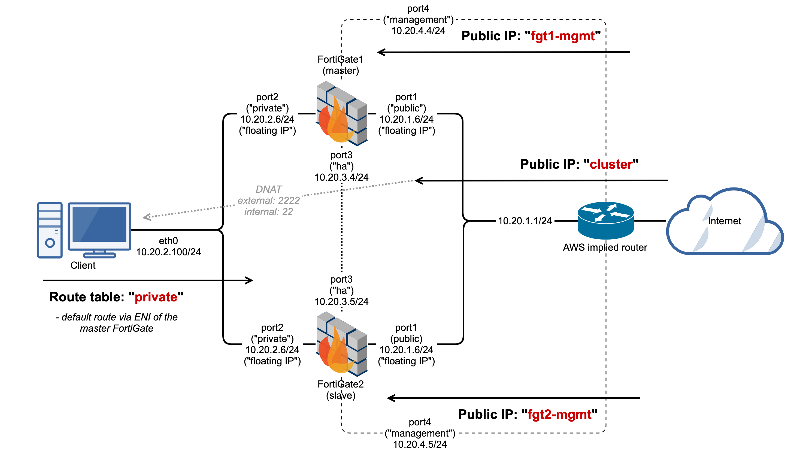
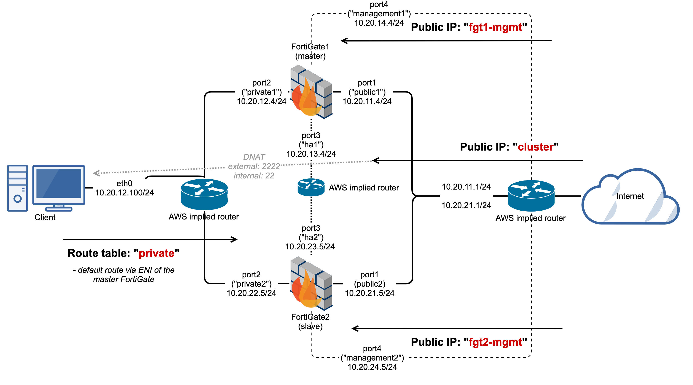

# Unicast HA and client VM templates for AWS

This repository contains step-by-step interactive guides and CloudFormation templates to quickly create either single-zone or multi-zone FortiGate HA configuration in AWS. 

Everybody can use it, but it is mainly meant for Fortinet TAC engineers to run simple tests without too much hassle.

## Common

  - In all example the HA is configured with override enabled and FortiGate1 set with higher priority to keep the setup predictable.
  - Step-by-step guides also create IPsec dialup server by default which CloudFormation templates don't do.
  - There is no SDN configuration prepared because it is not necessary for HA to work in AWS (unlike in Azure). 
  - After deployment the FortiGates reboot several times until they are fully useful. This can be confusing but it is normal.
  - Both FortiGate are preconfigured to form the HA, which happens right after they both boot up, but it takes several minutes for slave to synchronize its configuration file.
  
Any configuration can be changed after deployment.

## Single zone

### Description

In single-zone setup there are 4 different networks attached (public, private, HA, management) attached to each FortiGate (port1, port2, port3, port4 respectively). 

There is one automatically created route table which is used for "ha" network, and 3 explicitly created routing tables:
  - **public** : attached to "public" network, with default route via Internet gateway in VPC.
  - **private** : attached to "private" network, with default route via port2 of the master FortiGate.
  - **management** : attached to "management" network, with default route via Internet gateway in VPC.

Both master and slave FortiGates share the same subnets and therefore need to have different IP addresses. However, for public and private networks (port1 and port2) the primary IP addresses configured in AWS are not used and instead the same one address configured as secondary in AWS is used on both FortiGates as a standard ("primary") IP. Thanks to this, the sessions going between port1 and port2 can continue after failover even when NAT is enabled.

### Step-by-step configuration guide

[Single-zone A-P HA](https://ondrejholecek.github.io/aws-templates/#apha-single-zone)

### CloudFormation template

With default VPC range the setup look like on othe following diagram. 

CloudFormation Stack template is stored in S3 in EMEA TAC account and it is not automatically synchronizing with this repository. In case somebody deletes it, [download it manually from here](fgt-ha-ap-single-zone.json) and upload to CloudFormation as file.

Following parameters are requested when deploying the Stack:
  - **ImageClient** : This is the AMI ID (in the form of "ami-1234abcd5678efgh") of the client's VM operating system. It is expected that this is Linux VM, but in fact the OS should not matter (however, keep in mind that only port 2222 of the "Cluster IP" is forwarded to its port 22 by default). *All AMIs are unique to the region you are deploying it in. You can find the right ID in "EC2 >> Images >> AMIs" and search for "Public images" with "AMI Name : ^debian-10".*
  - **ImageFortiGate** : AMI ID of the FortiGate to deploy. *All AMIs are unique to the region you are deploying it in. You can find the right ID in "EC2 >> Images >> AMIs" and search for "Public images" with "AMI Name : ^FortiGate-VM64-AWS".*
  - **KeyPair** : Key pair must be already configured in AWS Region. It is used to access the Linux VM and FortiGates with user "admin" over SSH.
  - **Role** : Predefined "FortiOS_unicast_HA" role is necessary for the HA to work correctly.
  - **Username** : Fill your LDAP name (without the domain part) to track resources utilization. All automatically created object will be prefixed with it.
  - **VpcRange** : Range of the newly created VPC. It doesn't need to be unique if you don't plan to connect more VPCs together. It is automatically /16 and all the automatically created subnets are /24.
  - **Zone** : Availability zone to create devices in. It is only important if you plan to test in inter-zone communication to some other already existing devices.
  
When you are done with testing, please delete the Stack - it should automatically remove all the objects that it created previously.
  

## Multi zone

### Description

In multi-zone setup there are 8 different networks attached. Four of them are created in the first Availability zone (public1, private1, ha1, management1) and attached to first FortiGate's interfaces (port1, port2, port3, port4 respectively) and another four are created in the second Availability zone (public2, private2, ha2, management2) and attached to second FortiGate's interfaces. 

There is one automatically created route table which is used for "ha1" and "ha2" networks, and 3 explicitly created routing tables:
  - **public** : attached to "public1" and "public2" networks, with default route via Internet gateway in VPC.
  - **private** : attached to "private1" and "private2" networks, with default route via port2 of the master FortiGate.
  - **management** : attached to "management1" and "management2" networks, with default route via Internet gateway in VPC.

Because all devices are in single VPC, they can all communicate together and share route tables, regardless of being in different Availability zones.

However, being in different Availability zones, local IP addresses are different on each FortiGate and therefore NATed sessions (which will be probably most of them) cannot continue after HA failover and they need to be restarted by clients.

### Step-by-step configuration guide

[Multi-zone A-P HA](https://ondrejholecek.github.io/aws-templates/#apha-multi-zone)

### CloudFormation template

With default VPC range the setup look like on othe following diagram. 

CloudFormation Stack template is stored in S3 in EMEA TAC account and it is not automatically synchronizing with this repository. In case somebody deletes it, [download it manually from here](fgt-ha-ap-multi-zone.json) and upload to CloudFormation as file.

The parameters requested by CloudFormation Stack template are the same as for Single-zone setup, only instead of one parameter "Zone" there are two - "Zone1" and "Zone2". In "Zone1" first FortiGate and client VM are created and in "Zone2" only the second FortiGate is created.

When you are done with testing, please delete the Stack - it should automatically remove all the objects that it created previously.

